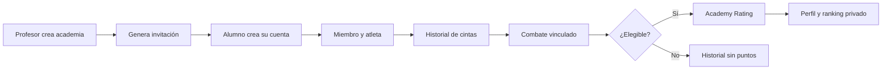
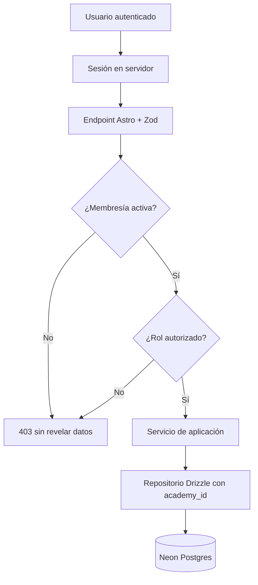
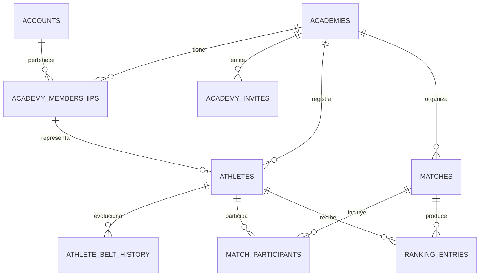
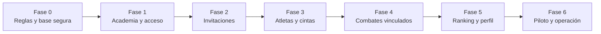

# Plan de implementación: academia, atletas, cuentas y ranking interno

**Estado:** planificado. Este es el documento canónico de la siguiente
expansión; no cambia todavía el marcador, rutas ni esquema de producción.

## Objetivo

Tatami Score evolucionará de marcador operativo a herramienta interna de una
academia. Un profesor crea la academia, invita alumnos, registra su evolución de
cintas y consulta un ranking privado, explicable y auditable. El marcador se
conserva: torneos, visitantes e invitados seguirán usando nombres manuales.



### Resultado esperado

- El profesor administra alumnos sin manejar contraseñas.
- El atleta con cuenta puede ver su perfil, historial y ranking interno.
- El operador selecciona atletas existentes o competidores invitados.
- Ganar vale igual por puntos, sumisión o decisión; solo la diferencia de cinta
  modifica el valor de la victoria.
- Cualquier posición y cambio de cinta se puede explicar desde su historial.

### Fuera de alcance

- Fotos, archivos, datos médicos, biometría o Neon Storage.
- Perfiles públicos, pagos, inscripciones, mensajería, ranking entre academias.
- Cambio automático de cinta, bonus por sumisión o categorías deducidas desde
  texto libre.

## Decisiones de producto

| Tema | Decisión |
| --- | --- |
| Aislamiento | La academia es el tenant; sus datos no se mezclan con otra. |
| Registro | Cuenta personal + código de invitación de la academia. |
| Contraseñas | Neon Auth o proveedor externo; la aplicación nunca las guarda. |
| Invitados | Permanecen en el marcador, pero no entran al ranking. |
| Cinta | Historial más instantánea por participante y combate. |
| Modalidad | Gi y No-Gi son filtros separados o combinados. |
| Ranking | Privado por academia y auditable por combate. |
| Método de victoria | No añade ni quita puntos: ganar es ganar. |

### Decisiones que se deben confirmar antes de calcular ranking

1. **Derrota:** recomendación v1: resta `0`; cuenta en el récord.
2. **Empate o resultado sin ganador:** recomendación v1: sin puntos y visible
   en historial.
3. **Ingreso por invitación:** recomendación: acceso inmediato como atleta si
   el código está vigente; el profesor puede suspender la membresía. Una
   aprobación manual sería una extensión posterior.
4. **Peso, edad y género:** solo entran como filtros cuando existan campos
   estructurados validados; no se infieren de `division`.

## Roles y permisos

| Acción | Dueño | Entrenador | Operador | Atleta |
| --- | :---: | :---: | :---: | :---: |
| Configurar academia y roles | Sí | No | No | No |
| Crear, revocar o rotar invitaciones | Sí | Sí | No | No |
| Gestionar atletas y cintas | Sí | Sí | No | Propio: futuro |
| Crear/cerrar combates | Sí | Sí | Sí | No |
| Validar para ranking | Sí | Sí | Permiso explícito | No |
| Consultar ranking | Sí | Sí | Sí | Sí |
| Consultar historial ajeno | Sí | Sí | Permiso explícito | Solo propio |

Los roles viven en una membresía por academia, no como un campo global de la
cuenta. Esto deja abierta la posibilidad de roles distintos en otra academia.

## Seguridad y arquitectura



- El cliente no decide `academyId`, rol ni elegibilidad: se derivan de sesión y
  membresía en servidor.
- Cada lectura/escritura interna filtra por `academy_id` o llega a él mediante
  una relación verificada.
- El PIN se almacena como hash, tiene expiración, máximo de usos, autor,
  revocación y rotación; jamás funciona como contraseña.
- Los endpoints de combate no se reutilizan para datos privados sin antes
  añadir autenticación y autorización.
- Los datos actuales de nombre y academia en `matches` son instantáneas: editar
  una ficha no cambia un acta histórica.

## Modelo de datos objetivo



| Tabla | Campos clave previstos | Responsabilidad |
| --- | --- | --- |
| `academies` | `id`, `name`, `slug`, `created_at` | Tenant y datos mínimos. |
| `accounts` | `id`, `auth_user_id`, `display_name` | Puente con el proveedor de identidad. |
| `academy_memberships` | `academy_id`, `account_id`, `role`, `status` | Pertenencia y permisos. |
| `academy_invites` | `academy_id`, `code_hash`, vencimiento, usos, revocación | Invitación controlada. |
| `athletes` | `academy_id`, `membership_id`, nombre, cinta actual, activo | Ficha deportiva. |
| `athlete_belt_history` | atleta, cinta, fecha, responsable, nota | Ascensos auditables. |
| `matches` extendida | `academy_id` durante transición | Acta y configuración. |
| `match_participants` | combate, esquina, atleta opcional, cinta instantánea | Vínculo sin perder invitados. |
| `ranking_entries` | academia, combate, atleta, puntos, versión de regla | Libro mayor inmutable. |

Restricciones: membresía única por cuenta/academia; una esquina por combate;
una entrada por atleta, combate y versión; índices por academia, estado, fecha,
modalidad y consultas de ranking.

## Academy Rating v1

Solo participa un combate completo, con ganador, dos atletas de la misma
academia y elegibilidad confirmada. Invitados y resultados incompletos quedan
solo en historial.

| Cinta | Nivel |
| --- | ---: |
| Blanca | 1 |
| Azul | 2 |
| Morada | 3 |
| Marrón | 4 |
| Negra | 5 |

```text
puntos de victoria = limitar(12 + 4 × (nivel del rival - nivel propio), 4, 28)
```

| Ejemplo | Puntos |
| --- | ---: |
| Blanca vence a blanca | 12 |
| Blanca vence a azul | 16 |
| Blanca vence a morada | 20 |
| Blanca vence a negra | 28 |
| Negra vence a blanca | 4 |

La cinta usada es la instantánea al disputar el combate. La entrada conserva
`rule_version = academy-rating-v1`; corregir resultado, elegibilidad o cinta
invalida y regenera sus entradas en transacción, sin modificar la cronología.

Filtros previstos: general, cinta al disputar el combate, Gi, No-Gi, ambas y
periodo cuando existan temporadas definidas.

## Vistas previstas

| Vista | Usuario | Contenido mínimo |
| --- | --- | --- |
| Crear academia | Profesor | Nombre y dueño inicial. |
| Unirse | Alumno | Cuenta, código y confirmación. |
| Panel de academia | Dueño/entrenador | Miembros, atletas, invitaciones y accesos. |
| Directorio/ficha | Equipo técnico | Buscar, estado, cinta, récord e historial. |
| Invitaciones | Dueño/entrenador | Crear, copiar, vencer, revocar y rotar. |
| Preparar/cerrar combate | Operador | Atleta o invitado y elegibilidad explícita. |
| Ranking | Miembros autorizados | Tabla, filtros y explicación de puntos. |
| Mi perfil | Atleta | Datos propios, historial y posición. |

## Fases de implementación



### Fase 0 — Reglas y base segura

- Confirmar las cuatro decisiones pendientes y registrar `academy-rating-v1`.
- Configurar Neon Auth/proveedor y URLs de desarrollo, preview y producción.
- Crear rama Neon; validar `Drizzle generate → migrate → test`.
- Auditar endpoints actuales: no habrá escrituras privadas sin sesión.

**Salida:** sesión de prueba y migración vacía en una rama de Neon, sin tocar
producción.

### Fase 1 — Academia, identidad y aislamiento

- Migrar `academies`, `accounts`, `academy_memberships` y `academy_id` de
  transición en `matches`.
- Crear alta del dueño, academia y guardas de sesión/rol en servidor.
- Probar que una academia nunca lee ni escribe datos de otra.

**Salida:** academia aislada con dueño y rutas privadas protegidas.

### Fase 2 — Invitaciones y miembros

- Migrar `academy_invites` y crear/rotar/revocar/consumir códigos atómicamente.
- Construir alta de alumno y membresía de atleta.
- Probar vencimiento, revocación, límite de usos y concurrencia.

**Salida:** profesor invita sin administrar contraseñas.

### Fase 3 — Atletas y cintas

- Migrar `athletes` y `athlete_belt_history`.
- Crear directorio, ficha, activación/suspensión, vínculo de miembro y ascenso.
- Probar que los cambios de cinta no mutan instantáneas históricas.

**Salida:** padrón y evolución deportiva auditables.

### Fase 4 — Combates vinculados

- Migrar `match_participants`, instantáneas de cinta y campos de elegibilidad.
- Permitir elegir atleta o invitado en cada esquina y validar pertenencia.
- Invalidar cálculo cuando se corrige un resultado.

**Salida:** marcador actual produce actas preparadas para ranking sin perder su
modo manual.

### Fase 5 — Ranking y perfil

- Migrar `ranking_entries` inmutables y versionadas.
- Implementar cálculo puro, emisión/reversión transaccional, tabla filtrable y
  perfil propio.
- Probar todas las diferencias de cinta, límites `4..28`, filtros y
  recalculación idempotente.

**Salida:** posición explicable por entradas de combate y acceso limitado por
rol.

### Fase 6 — Piloto y operación

- Ejecutar E2E en móvil/escritorio, accesibilidad, auditoría y respaldo.
- Probar alta, invitación, Gi/No-Gi, ascenso, corrección y dos academias.
- Hacer piloto interno y priorizar mejoras antes de ampliar el alcance.

**Salida:** piloto aprobado para la academia.

## Migración, pruebas y definición de terminado

1. Cada fase empieza en una rama Git y Neon derivada de producción.
2. Todo cambio de esquema se modela en Drizzle, genera una migración nueva y se
   prueba primero en esa rama. No se editan migraciones aplicadas.
3. La base actual está limpia: combates sin `academy_id` permanecerán fuera de
   ranking hasta que un responsable los asigne.
4. Producción se migra desde un entorno seguro con `DATABASE_URL_UNPOOLED`;
   Vercel mantiene solo `DATABASE_URL` agrupada.
5. En cada fase se exigen pruebas de dominio, repositorio, API y flujo E2E
   pertinente, además de `npm run check` y `npm run build`.

Riesgos controlados: PIN compartido (expiración y revocación), fuga entre
academias (guardas y pruebas de acceso cruzado), ranking poco creíble (fórmula y
libro mayor explicables) y crecimiento de alcance (sin fotos, pagos ni brackets
antes del piloto).

## Checklist para iniciar

- [ ] Confirmar las decisiones pendientes.
- [ ] Abrir rama Git y rama Neon de la fase activa.
- [ ] Configurar autenticación sin guardar secretos en el repositorio.
- [ ] Escribir primero pruebas de dominio y autorización.
- [ ] Generar y revisar migración Drizzle.
- [ ] Implementar servicio de aplicación antes de componentes.
- [ ] Ejecutar validaciones y actualizar documentación/ADR.
